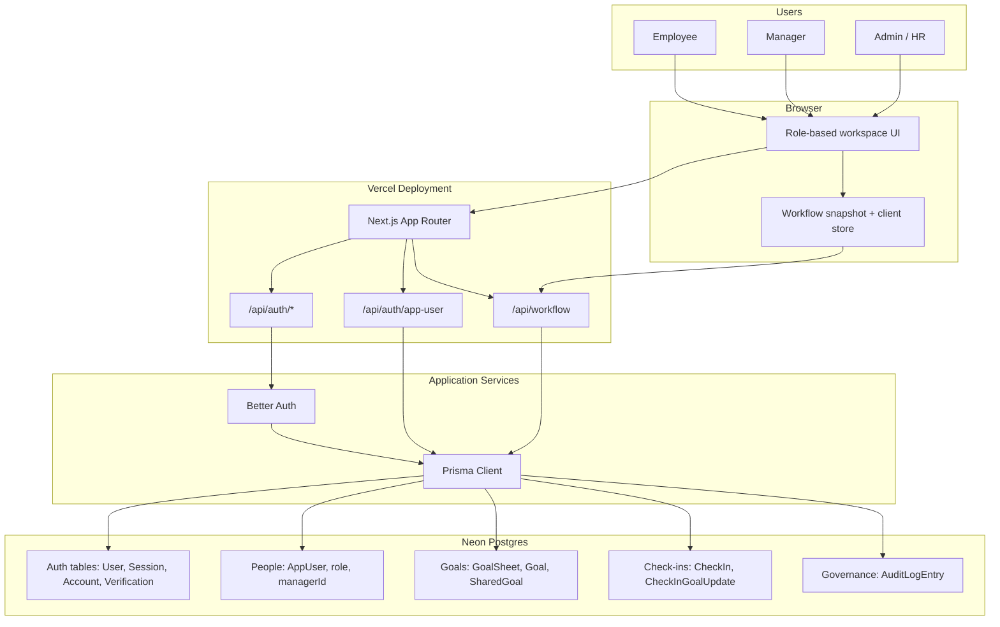

# AtomQuest Goal Setting Portal

## Architecture

The application is a single **Next.js App Router** app. Vercel hosts the UI and server routes together, so there is no separate backend deployment. **Better Auth** manages login/session persistence, while app-specific roles and reporting lines live in `AppUser`. All product workflow data is persisted in **Neon Postgres** through **Prisma**.

Core server routes:

- `/api/auth/*` handles Better Auth login, signup, sessions, and logout.
- `/api/auth/app-user` creates the app role mapping after signup.
- `/api/workflow` handles goal sheets, approvals, shared goals, check-ins, admin unlocks, org hierarchy updates, and audit entries.

## Evaluator Notes

- I have already created demo accounts that you can use directly for testing.
- Use the Employee account to create, edit, save, and submit goal sheets.
- Use the Manager account to review submitted goal sheets, edit target/weightage, approve, return for rework, and review check-ins.
- Use the Admin account to view dashboard counts, unlock approved goal sheets, view reports, and inspect audit logs.
- Public signup is enabled for hackathon demo convenience and lets the tester choose a role.

## Demo Accounts

The project already includes one seeded demo account for each role:

- Employee: `employee@atomquest.test` / `Employee@123`
- Manager: `manager@atomquest.test` / `Manager@123`
- Admin: `admin@atomquest.test` / `Admin@123`

Additional employee accounts created for testing:

- Employee 1: `employee1@gmail.com` / `password`
- Employee 2: `employee2@gmail.com` / `password`
- Employee 3: `employee3@gmail.com` / `password`

You can also create a new Employee, Manager, or Admin account from the **Create Account** section on the login page.
